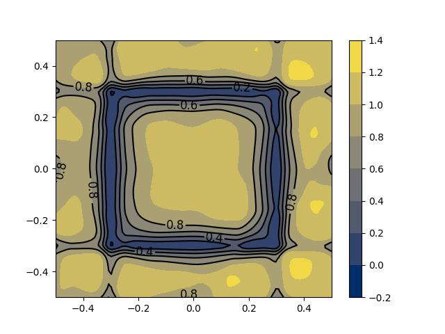

# About
Solutions of certain partial differential equations (PDEs) are often represented by the steepest descent curves of corresponding functionals. Minimizing movement scheme was developed in order to study such curves in metric spaces. Especially, Jordan-Kinderlehrer-Otto studied the Fokker-Planck equation in this way with respect to the Wasserstein metric space. In this paper, we propose a deep learning-based minimizing movement scheme for approximating the solutions of PDEs. The proposed method is highly scalable for high-dimensional problems as it is free of mesh generation. We demonstrate through various kinds of numerical examples that the proposed method accurately approximates the solutions of PDEs by finding the steepest descent direction of a functional even in high dimensions.
* [The Deep Minimizing Movement Scheme](https://arxiv.org/abs/2109.14851) (Hwang 2021)

That means rather than only optimizing an energy $$\min_\theta \mathcal{A}(u_\theta)  $$ for a neural network $u$ with parameter $\theta$, we optimize $\theta_{k+1}:= \min_\theta \|u_k - u_\theta \| +\tau \mathcal{A}(u_\theta) $

* [Learning Geometric Phase Field representations](https://drive.google.com/drive/u/0/folders/1LKQha7mYWvPzKKS2yC0zf_19FEzRlly8) (Yannick Kees 2022)

